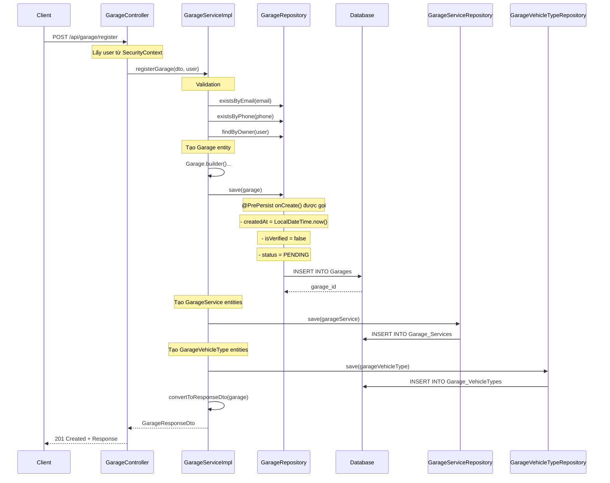
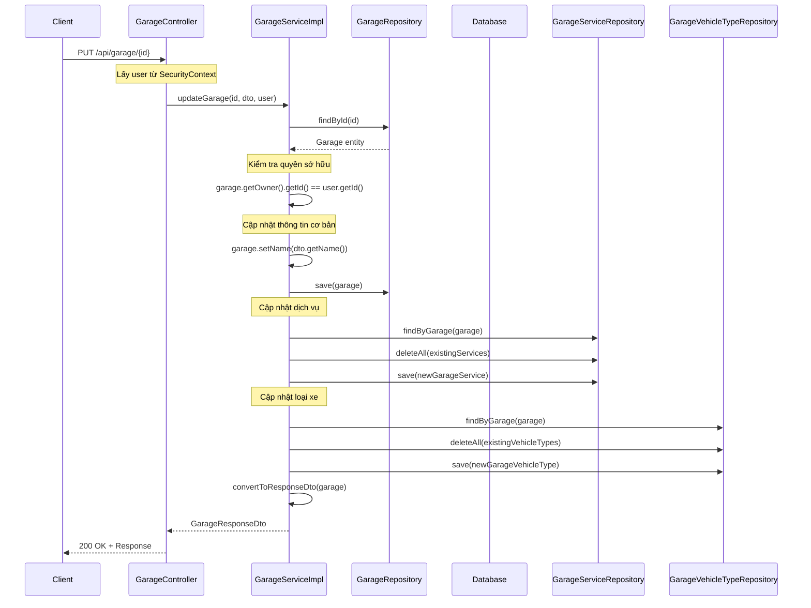
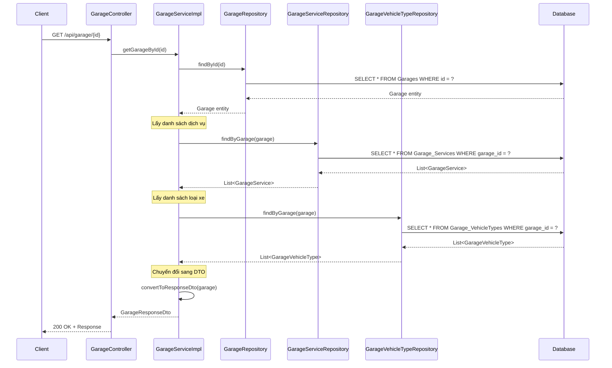

# Garage API Documentation - Hoang

## Tổng quan
Tài liệu này mô tả các API cho vai trò Garage trong hệ thống XeCare2.

## Base URL
```
http://localhost:8080/api/garage
```

## Authentication
Tất cả các API yêu cầu authentication thông qua JWT token trong header:
```
Authorization: Bearer <jwt_token>
```

## API Endpoints

### 1. Đăng ký Garage mới
**POST** `/register`

**Request Body:**
```json
{
  "name": "Garage ABC",
  "description": "Chuyên sửa xe máy và ô tô",
  "address": "123 Đường ABC, Quận 1, TP.HCM",
  "phone": "0123456789",
  "email": "garage@example.com",
  "latitude": 10.762622,
  "longitude": 106.660172,
  "openTime": "08:00:00",
  "closeTime": "18:00:00",
  "serviceIds": [1, 2, 3],
  "vehicleTypeIds": [1, 2]
}
```

**Response (201 Created):**
```json
{
  "id": 1,
  "name": "Garage ABC",
  "description": "Chuyên sửa xe máy và ô tô",
  "address": "123 Đường ABC, Quận 1, TP.HCM",
  "phone": "0123456789",
  "email": "garage@example.com",
  "latitude": 10.762622,
  "longitude": 106.660172,
  "openTime": "08:00:00",
  "closeTime": "18:00:00",
  "imageUrl": null,
  "isVerified": false,
  "status": "PENDING",
  "createdAt": "2024-01-01T10:00:00",
  "ownerId": 1,
  "ownerName": "Nguyễn Văn A",
  "ownerEmail": "owner@example.com",
  "services": [
    {
      "id": 1,
      "serviceId": 1,
      "serviceName": "Sửa lốp",
      "serviceDescription": "Sửa chữa lốp xe",
      "basePrice": null,
      "estimatedTimeMinutes": null,
      "isActive": true
    }
  ],
  "vehicleTypes": [
    {
      "id": 1,
      "vehicleTypeId": 1,
      "vehicleTypeName": "Xe máy",
      "vehicleTypeDescription": "Xe máy các loại",
      "isActive": true
    }
  ]
}
```

### 2. Cập nhật thông tin Garage
**PUT** `/{id}`

**Request Body:**
```json
{
  "name": "Garage ABC Updated",
  "description": "Chuyên sửa xe máy và ô tô chất lượng cao",
  "address": "456 Đường XYZ, Quận 2, TP.HCM",
  "phone": "0987654321",
  "email": "garage.updated@example.com",
  "latitude": 10.762622,
  "longitude": 106.660172,
  "openTime": "07:00:00",
  "closeTime": "19:00:00",
  "imageUrl": "https://example.com/garage-image.jpg",
  "serviceIds": [1, 2, 3, 4],
  "vehicleTypeIds": [1, 2, 3]
}
```

**Response (200 OK):**
```json
{
  // Tương tự như response của đăng ký
}
```

### 3. Lấy thông tin Garage theo ID
**GET** `/{id}`

**Response (200 OK):**
```json
{
  // Thông tin garage
}
```

### 4. Lấy thông tin Garage của user hiện tại
**GET** `/my-garage`

**Response (200 OK):**
```json
{
  // Thông tin garage của user đang đăng nhập
}
```

### 5. Lấy danh sách Garage theo trạng thái
**GET** `/status/{status}`

**Parameters:**
- `status`: PENDING, ACTIVE, INACTIVE

**Response (200 OK):**
```json
[
  {
    // Thông tin garage
  }
]
```

### 6. Tìm kiếm Garage theo tên
**GET** `/search/name?name={name}`

**Response (200 OK):**
```json
[
  {
    // Danh sách garage có tên chứa từ khóa
  }
]
```

### 7. Tìm kiếm Garage theo địa chỉ
**GET** `/search/address?address={address}`

**Response (200 OK):**
```json
[
  {
    // Danh sách garage có địa chỉ chứa từ khóa
  }
]
```

### 8. Tìm Garage gần nhất
**GET** `/nearby?latitude={lat}&longitude={lng}&radius={radius}`

**Parameters:**
- `latitude`: Vĩ độ
- `longitude`: Kinh độ  
- `radius`: Bán kính tìm kiếm (km), mặc định 10km

**Response (200 OK):**
```json
[
  {
    // Danh sách garage trong bán kính
  }
]
```

### 9. Xóa Garage
**DELETE** `/{id}`

**Response (204 No Content):**
```
// Xóa thành công
```

### 10. Kiểm tra email đã tồn tại
**GET** `/check-email?email={email}`

**Response (200 OK):**
```json
true  // Email đã tồn tại
false // Email chưa tồn tại
```

### 11. Kiểm tra số điện thoại đã tồn tại
**GET** `/check-phone?phone={phone}`

**Response (200 OK):**
```json
true  // Số điện thoại đã tồn tại
false // Số điện thoại chưa tồn tại
```

## Error Responses

### 400 Bad Request
```json
{
  "error": "Validation failed",
  "message": "Tên garage không được để trống"
}
```

### 401 Unauthorized
```json
{
  "error": "Unauthorized",
  "message": "Token không hợp lệ"
}
```

### 403 Forbidden
```json
{
  "error": "Forbidden",
  "message": "Bạn không có quyền thực hiện hành động này"
}
```

### 404 Not Found
```json
{
  "error": "Not Found",
  "message": "Garage không tồn tại"
}
```

### 500 Internal Server Error
```json
{
  "error": "Internal Server Error",
  "message": "Lỗi server"
}
```

## Validation Rules

### GarageRegistrationDto
- `name`: Bắt buộc, 2-100 ký tự
- `address`: Bắt buộc, tối đa 255 ký tự
- `phone`: Bắt buộc, định dạng 10-11 số
- `email`: Bắt buộc, định dạng email hợp lệ
- `latitude`: Bắt buộc
- `longitude`: Bắt buộc
- `serviceIds`: Bắt buộc, ít nhất 1 dịch vụ
- `vehicleTypeIds`: Bắt buộc, ít nhất 1 loại xe

### GarageUpdateDto
- Tất cả fields đều optional
- Validation tương tự như RegistrationDto nếu có giá trị

## Business Rules

1. **Mỗi user chỉ có thể đăng ký 1 garage**
2. **Email và số điện thoại phải unique**
3. **Chỉ chủ sở hữu mới có quyền cập nhật/xóa garage**
4. **Garage mới đăng ký có status PENDING và isVerified = false**
5. **Admin cần phê duyệt để chuyển status thành ACTIVE**

## Files được tạo bởi Hoang

### Repositories
- `GarageRepository.java`
- `GarageServiceRepository.java` 
- `GarageVehicleTypeRepository.java`
- `ServiceRepository.java`
- `VehicleTypeRepository.java`

### DTOs
- `GarageRegistrationDto.java`
- `GarageUpdateDto.java`
- `GarageResponseDto.java`

### Services
- `GarageServiceInterface.java`
- `GarageServiceImpl.java`

### Controllers
- `GarageController.java`

### Security
- Cập nhật `AppUserDetails.java` (thêm getUser() method) 

## Luồng chạy của dự án với code mới

### Luồng đăng ký Garage (POST /api/garage/register)



### Luồng cập nhật Garage (PUT /api/garage/{id})



### Luồng lấy thông tin Garage (GET /api/garage/{id})



## Lợi ích của @PrePersist

1. **Tự động hóa**: Không cần nhớ set các giá trị mặc định
2. **Đảm bảo tính nhất quán**: Luôn có giá trị cho các field quan trọng
3. **Giảm lỗi**: Tránh quên set timestamp, status mặc định
4. **Code sạch hơn**: Không cần set nhiều giá trị trong business logic

 

## Kiểm tra email và phone đã tồn tại chưa

```java
// Kiểm tra email và phone đã tồn tại chưa
if (garageRepository.existsByEmail(registrationDto.getEmail())) {
    throw new IllegalArgumentException("Email đã được sử dụng bởi garage khác");
}

if (garageRepository.existsByPhone(registrationDto.getPhone())) {
    throw new IllegalArgumentException("Số điện thoại đã được sử dụng bởi garage khác");
}

// Kiểm tra owner đã có garage chưa
if (garageRepository.findByOwner(owner).isPresent()) {
    throw new IllegalArgumentException("Bạn đã có garage rồi");
}
``` 